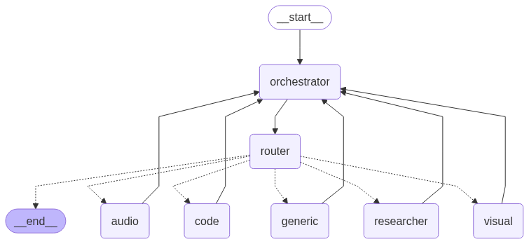
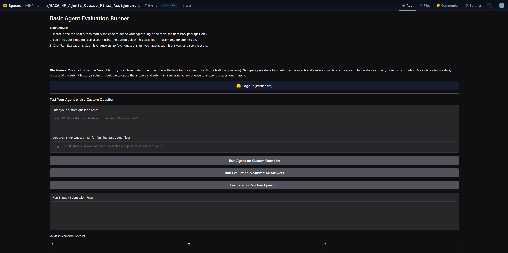

**1. ABOUT**

This repository contains code needed to solve the final assignment of the [HuggingFace Agents course](https://huggingface.co/learn/agents-course/unit0/introduction) which aims to solve Level 1 questions from the [GAIA benchmark](https://huggingface.co/papers/2311.12983) which is designed to evaluate AI Assistants on real world tasks.

**2. LANGGRAPH ARCHITECTURE**

In a nutshell, the code in this project takes inspiration from supervisor pattern mentioned in the [langgraph docs](https://langchain-ai.github.io/langgraph/concepts/multi_agent/) as well as the newly released github package ([langgraph-supervisor](https://github.com/langchain-ai/langgraph-supervisor-py)) and is simpler reimplementation of it.
Each agent is powered by LLMs from popular free inference providers like HuggingFace, OpenRouter and GROQ

It contains the following agents/blocks:

1. Orchestrator Agent: This agent is the manager/supervisor which is responsible for creating a high level plan and then delegating tasks to specialized sub-agents (mentioned below) while having back and forth conversions to achieve a particular task. This node also serves as the final node responsible for outputting the final answer for the original user query.
2. Router: This node is responsible for knowing which sub-agent to delegate the task to along with any context required by that subagent which the Orchestrator provides.
3. Audio Sub Agent: This agent implements tools for transcribing local audio files or audio from youtube urls and can answer questions based on the audio. It uses the Whisper model for transcription
4. Code Sub Agent: This agent implements tools for generating/executing python code directly on the file system. (NOTE: this does not use a sandbox and executes it directly in the same virtual environment). This agent is called whenever there are hard mathematical problems or whenever there are complex queries solvable using code.
5. Generic Sub Agent: This agent has tools for websearch and is the default fallback model and has been prompted to give some answer to the query (even if it is a hallucination)
6. Researcher Sub Agent: This agent also has tools for websearch, arxivsearch and wikisearch and can answer questions which can be solved by access to basic internet search
7. Visual Sub Agent: This agent is powered by a multimodal LLM which accepts images as input and can answer questions on the image. 

**3. CODE STRUCTURE**

- app.py : Contains a simple Gradio application which powers the application. 
    * The team who created the assignment, essentially exposed some APIs and a Gradio template for testing this assignment as there are APIs to fetch questions and submit answers to Huggingface for evaluation.
- expected_answers.json : Contains a reverse engineered set of answers for the GAIA Level 1 validation set for easier debugging during development
- requirements.txt: Contains the python packages needed for running this project
- .env : This environment file (not present in this repository) needs to have secret keys for running inference using model providers like HuggingFace, OpenRouter and Groq. Additionally Langfuse has also been configured for easier monitoring.
- ./analysis: This directory contains ipynb files which analyses the GAIA dataset to infer what kinds of tools were needed along with code to visualize the langgraph agent setup
- ./prompts: This directory contains text prompt file for each agent in this system to think in a ReACT like manner.
- ./resources: This directory contains images for use in this readme file
- ./tools: This directory contains implementations of the various tools used by the agents (ranging from websearch, code execution, audio transcription along with orchestration handoff tools)
- ./agents: This directory contains the implementations of the various Langgraph nodes, agents and the entire workflow along with defining models for the agent state to be used.

**4. POTENTIAL FUTURE WORK**

- Since the tools needed to be implemented were essentially reverse engineered from the questions found on the GAIA set (refer to the ./analysis folder) it is clearly not the complete set of all tools an ideal AI Assistant (like Jarvis is supposed to have :( ))
- There are newer models (like Meta-VJEPA-2) which can also take in a video as input but this option was not considered due to the cost of inference on inference providers like HuggingFace and OpenRouter.